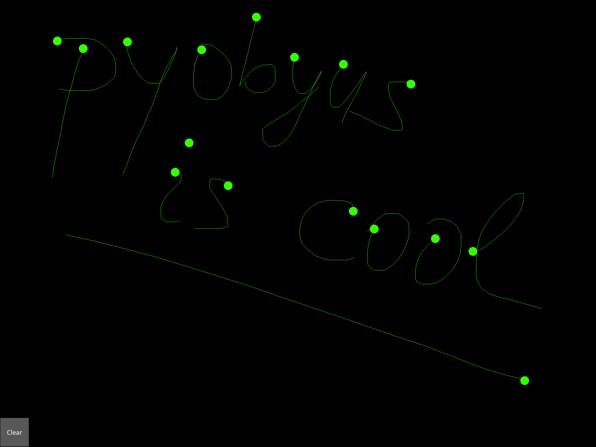
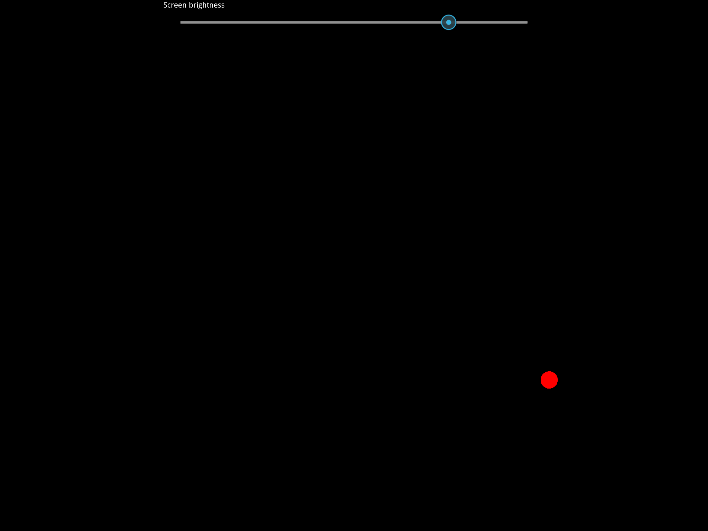

.. _pyobjus_ios:

Pyobjus on iOS
==============

You may be wondering how to run pyobjus on iOS devices?
The solution to this problem is to use
`kivy-ios <https://github.com/kivy/kivy-ios>`_.

As you can see, kivy-ios contains scripts for building kivy, pyobjus and other
libraries needed for running your app. It also provides scripts for making
xcode projects from which you can run your python/kivy/pyobjus applications.
Sounds great, and it is.

Example with Kivy UI
--------------------

Let's first build kivy-ios. Execute following command::

    git clone https://github.com/kivy/kivy-ios.git
    cd kivy-ios
    ./toolchain.py build kivy pyobjus

This can take some time.

You can build your UI with the kivy framework, and access device hardware
using pyobjus. So, let's look at one simple example of this. Notice that
a tutorial describing how to use kivy-ios exists as part of the official
kivy-ios documentation, but here we will provide another one, with focus on
pyobjus.

Let's first make one simple example of using pyobjus with kivy.::

    from pyobjus import autoclass, objc_f, objc_str
    from kivy.app import App
    from kivy.uix.widget import Widget
    from kivy.uix.button import Button
    from kivy.uix.label import Label
    from kivy.graphics import Color, Ellipse, Line

    NSArray = autoclass('NSArray')
    array = NSArray.arrayWithObjects_(objc_f(0.3), objc_f(1), objc_f(1), None)

    class MyPaintWidget(Widget):

        def on_touch_down(self, touch):
            color = (array.objectAtIndex_(0).floatValue(), array.objectAtIndex_(1).floatValue(), array.objectAtIndex_(2).floatValue())
            with self.canvas:
                Color(*color, mode='hsv')
                d = 30.
                Ellipse(pos=(touch.x - d / 2, touch.y - d / 2), size=(d, d))
                touch.ud['line'] = Line(points=(touch.x, touch.y))

        def on_touch_move(self, touch):
            touch.ud['line'].points += [touch.x, touch.y]

    class MyPaintApp(App):

        def build(self):
            parent = Widget()
            painter = MyPaintWidget()
            btn_text = objc_str('Clear')
            clearbtn = Button(text=btn_text.UTF8String())
            parent.add_widget(painter)
            parent.add_widget(clearbtn)

            def clear_canvas(obj):
                painter.canvas.clear()
            clearbtn.bind(on_release=clear_canvas)

            return parent

    if __name__ == '__main__':
        MyPaintApp().run()

Please save this code inside a file with the name ``main.py``. You will need to
make a directory which will hold your python application code. For example, you
can do the following::

    mkdir ~/paint
    mv main.py ~/paint

So now ``paint`` contains ``main.py`` file which holds your python code.

The example above is borrowed from
`this tutorial <http://kivy.org/docs/tutorials/firstwidget.html>`_
but we have added some pyobjus things to it. So we are now using a
``NSArray`` to store information about the line color, and we are using a
``NSString`` to set the text of the button.

Now you can create an xcode project which will hold our python application.
kivy-ios comes with script for creating xcode projects for you. You only need
to specify the project name and the absolute path to your app.

Execute the following command::

    ./toolchain.py create paintApp ~/paint/

Notice the following. The second parameter which we are passing to the script is
the name of our app. In this case, the name of our iOS app will be `paintApp`.
The third parameter is the absolute path to our python app which we want to
run on iOS.

After executing this command you will get output similar to this::

    -> Create /Users/myName/kivy-ios/paintApp-ios directory
    -> Copy templates
    -> Customize templates
    -> Done !

    Your project is available at /Users/myName/kivy-ios/paintapp-ios

    You can now type: open /Users/myName/kivy-ios/paintapp-ios/paintapp.xcodeproj

Note that the name is converted to lower case. If you enter the `paintapp-ios`
directory you will see that there are ``main.m``, ``bridge.m`` and other
resources.

You can open this project with xcode as follows::

    open /Users/myName/kivy-ios/paintapp-ios/paintapp.xcodeproj

If you have setup your developer account, you only need to click play and the
app will be deployed on your iOS device.

This is screenshot from my iPad.

Accessing the accelerometer
---------------------------

To access the accelerometer on iOS devices, you use the CoreMotion framework.
The CoreMotion framework is added by default in the project template which
ships with kivy-ios.

Let's say that we have a class interface with the following properties and
variables::

    @interface bridge : NSObject {
        NSOperationQueue *queue;
    }

    @property (strong, nonatomic) CMMotionManager *motionManager;
    @property (nonatomic) double ac_x;
    @property (nonatomic) double ac_y;
    @property (nonatomic) double ac_z;
    @end

Also, let's say that we have an init method which inits the ``motionManager``
and the ``queue``, and we have a method for running the accelerometer, and
that method is declared as follows::

    - (void)startAccelerometer {
        if ([self.motionManager isAccelerometerAvailable] == YES) {
            [self.motionManager startAccelerometerUpdatesToQueue:queue withHandler:^(CMAccelerometerData *accelerometerData, NSError *error) {
                self.ac_x = accelerometerData.acceleration.x;
                self.ac_y = accelerometerData.acceleration.y;
                self.ac_z = accelerometerData.acceleration.z;
            }];
        }
    }

You can see here that we are specifying a handler which will be called when we
get some updates from the accelerometer. Currently you can't implement this
handler from pyobjus, so that may be a problem.

But, we have solution for this. We have added a bridge class for this purpose:
to implement handlers in pure Objective C, and then call methods of the bridge
class so we can get the actual data in Python. In this example, we are storing
the `x`, `y` and `z` values from the accelerometer in the ``ac_x``, ``ac_y``
and ``ac_z`` class properties. We can then easily access these class
properties.

So let's see a basic example how to read accelerometer data from pyobjus::

    from pyobjus import autoclass

    def run():
        Bridge = autoclass('bridge')
        br = Bridge.alloc().init()
        br.motionManager.setAccelerometerUpdateInterval_(0.1)
        br.startAccelerometer()

        for i in range(10000):
            print 'x: {0} y: {1} z: {2}'.format(br.ac_x, br.ac_y, br.ac_z)

    if __name__ == "__main__":
        run()

So if you run this script on an iPad, in the way we have shown above, you'll
get output similar to this in the xcode console::

    x: 0.0219268798828 y: 0.111801147461 z: -0.976440429688
    x: 0.0219268798828 y: 0.111801147461 z: -0.976440429688
    x: 0.0219268798828 y: 0.111801147461 z: -0.976440429688
    x: 0.0219268798828 y: 0.111801147461 z: -0.964920043945
    x: 0.145629882812 y: -0.00624084472656 z: -0.964920043945
    x: 0.145629882812 y: -0.00624084472656 z: -0.964920043945
    x: 0.145629882812 y: -0.00624084472656 z: -0.964920043945
    x: 0.145629882812 y: -0.00624084472656 z: -0.964920043945

As you can see, we have data from the accelerometer, so you can use it for some
practical purposes if you want.

Accessing the gyroscope
-----------------------

In a similar way as we accessed the accelerometer, we can access the gyroscope.
So let's expand our bridge class interface with properties which will hold gyro
data::

    @property (nonatomic) double gy_x;
    @property (nonatomic) double gy_y;
    @property (nonatomic) double gy_z;

Then in the bridge class implementation, add the following method::

    - (void)startGyroscope {
        if ([self.motionManager isGyroAvailable] == YES) {
            [self.motionManager startGyroUpdatesToQueue:queue withHandler:^(CMGyroData *gyroData, NSError *error) {
                self.gy_x = gyroData.rotationRate.x;
                self.gy_y = gyroData.rotationRate.y;
                self.gy_z = gyroData.rotationRate.z;
            }];
        }
    }

This method is probably familiar to you because it is very similar to the
method used for getting accelerometer data. Let's write some python code
to read this data from python::

    from pyobjus import autoclass

    def run():
        Bridge = autoclass('bridge')
        br = Bridge.alloc().init()
        br.startGyroscope()

        for i in range(10000):
            print 'x: {0} y: {1} z: {2}'.format(br.gy_x, br.gy_y, br.gy_z)

    if __name__ == "__main__":
        run()

You will get output similar to this::

    x: 0.019542276079 y: 0.0267431973505 z: 0.00300590992237
    x: 0.019542276079 y: 0.0267431973505 z: 0.00300590992237
    x: 0.019542276079 y: 0.0267431973505 z: 0.00300590992237
    x: 0.019542276079 y: 0.0267431973505 z: 0.00300590992237
    x: 0.019542276079 y: 0.0267431973505 z: 0.00300590992237
    x: 0.019542276079 y: 0.018291389315 z: -0.00338913880323
    x: 0.018301243011 y: 0.018291389315 z: -0.00338913880323
    x: 0.018301243011 y: 0.018291389315 z: -0.00338913880323
    x: 0.018301243011 y: 0.018291389315 z: -0.00338913880323
    x: 0.018301243011 y: 0.018291389315 z: -0.00338913880323
    x: 0.018301243011 y: 0.018291389315 z: -0.00338913880323
    x: 0.0183009766949 y: 0.0170807162834 z: -0.00339499775763
    x: 0.0183009766949 y: 0.0170807162834 z: -0.00339499775763

So now you can use gyro data in your Python kivy application.

Accessing the magnetometer
--------------------------

You can probably guess that this will be almost identical to the previous two
examples. Let's add two new properties to the interface of the bridge class::

    @property (nonatomic) double mg_x;
    @property (nonatomic) double mg_y;
    @property (nonatomic) double mg_z;

And then add the following method to the bridge class::

    - (void)startMagnetometer {        
        if (self.motionManager.magnetometerAvailable) {
            [self.motionManager startMagnetometerUpdatesToQueue:queue withHandler:^(CMMagnetometerData *magnetometerData, NSError *error) {
                self.mg_x = magnetometerData.magneticField.x;
                self.mg_y = magnetometerData.magneticField.y;
                self.mg_z = magnetometerData.magneticField.z;
            }];
        }
    }

Now we can use the methods above from pyobjus to get the data from the
magnetometer::

    from pyobjus import autoclass

    def run():
        Bridge = autoclass('bridge')
        br = Bridge.alloc().init()
        br.startMagnetometer()

        for i in range(10000):
            print 'x: {0} y: {1} z: {2}'.format(br.mg_x, br.mg_y, br.mg_z)

    if __name__ == "__main__":
        run()

You will get output similar to this::

    x: 29.109375 y: -46.694519043 z: -27.4476470947
    x: 29.109375 y: -46.694519043 z: -27.4476470947
    x: 29.109375 y: -47.7679595947 z: -24.6468658447
    x: 28.03125 y: -47.7679595947 z: -24.6468658447
    x: 28.03125 y: -47.7679595947 z: -24.6468658447
    : 28.03125 y: -47.7679595947 z: -24.6468658447
    x: 28.03125 y: -47.7679595947 z: -24.6468658447
    x: 28.03125 y: -48.3046875 z: -27.4476470947
    x: 27.4921875 y: -48.3046875 z: -27.4476470947
    x: 27.4921875 y: -48.3046875 z: -27.4476470947
    x: 27.4921875 y: -48.3046875 z: -27.4476470947
    x: 27.4921875 y: -48.3046875 z: -27.4476470947
    x: 27.4921875 y: -47.2312469482 z: -28.5679626

You can add additional bridge methods to your pyobjus iOS app by changing the
content of the `bridge.m/.h` files, or by adding completely new files and
classes to your xcode project. After that, you can consume them with pyobjus
using the methods illustrated above.

Pyobjus-ball example
--------------------

We've made a simple example using the accelerometer to control a ball on
screen. In addition, with this example, you can set you screen brightness
using a kivy slider.

We won't go into the details of the kivy language or kivy itself as you can
find excellent examples and docs on the official kivy site.

So, here is the code of the ``main.py`` file::

    from random import random
    from kivy.app import App
    from kivy.uix.widget import Widget
    from kivy.properties import NumericProperty, ReferenceListProperty, ObjectProperty
    from kivy.vector import Vector
    from kivy.clock import Clock
    from kivy.graphics import Color
    from pyobjus import autoclass

    class Ball(Widget):

        velocity_x = NumericProperty(0)
        velocity_y = NumericProperty(0)
        h = NumericProperty(0)
        velocity = ReferenceListProperty(velocity_x, velocity_y)

        def move(self):
            self.pos = Vector(*self.velocity) + self.pos

    class PyobjusGame(Widget):

        ball = ObjectProperty(None)
        screen = ObjectProperty(autoclass('UIScreen').mainScreen())
        bridge = ObjectProperty(autoclass('bridge').alloc().init())
        sensitivity = ObjectProperty(50)
        br_slider = ObjectProperty(None)

        def __init__(self, *args, **kwargs):
            super(PyobjusGame, self).__init__()
            self.bridge.startAccelerometer()

        def __dealloc__(self, *args, **kwargs):
            self.bridge.stopAccelerometer()
            super(PyobjusGame, self).__dealloc__()

        def reset_ball_pos(self):
            self.ball.pos = self.width / 2, self.height / 2

        def on_bright_slider_change(self):
            self.screen.brightness = self.br_slider.value

        def update(self, dt):
            self.ball.move()
            self.ball.velocity_x = self.bridge.ac_x * self.sensitivity
            self.ball.velocity_y = self.bridge.ac_y * self.sensitivity

            if (self.ball.y < 0) or (self.ball.top >= self.height):
                self.reset_ball_pos()
                self.ball.h = random()

            if (self.ball.x < 0) or (self.ball.right >= self.width):
                self.reset_ball_pos()
                self.ball.h = random()

    class PyobjusBallApp(App):

        def build(self):
            game = PyobjusGame()
            Clock.schedule_interval(game.update, 1.0/60.0)
            return game

    if __name__ == '__main__':
        PyobjusBallApp().run()

And the contents of ``pyobjusball.kv`` are::

    <Ball>:
        size: 50, 50
        h: 0
        canvas:
            Color:
                hsv: self.h, 1, 1,
            Ellipse:
                pos: self.pos
                size: self.size          

    <PyobjusGame>:
        ball: pyobjus_ball
        br_slider: bright_slider

        Label:
            text: 'Screen brightness'
            pos: bright_slider.x, bright_slider.y + bright_slider.height / 2
        Slider:
            pos: self.parent.width / 4, self.parent.height / 1.1
            id: bright_slider
            value: 0.5
            max: 1
            min: 0
            width: self.parent.width / 2
            height: self.parent.height / 10
            on_touch_up: root.on_bright_slider_change()

        Ball:
            id: pyobjus_ball
            center: self.parent.center

Now create a directory with the name ``pyobjus-ball`` and place the files above
in it::

    mkdir pyobjus-ball
    mv main.py pyobjus-ball
    mv pyobjusball.kv pyobjus-ball

In this step, we assume that you have already have downloaded and built
``kivy-ios``. Navigate to the directory where ``kivy-ios`` is located,
then execute the following commands::

    tools/create-xcode-project.sh pyobjusBall /path/to/pyobjus-ball
    open app-pyobjusball/pyobjusball.xcodeproj/

After this step, xcode will open and, if you have connected your iOS
device to your computer, you can run the project and will see your app
running on your device.

This is a screenshot from an iPad.

